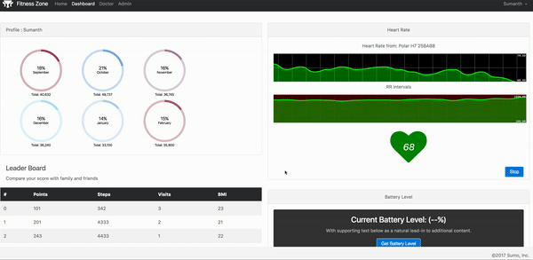

# Hub

This project was generated with [Angular CLI](https://github.com/angular/angular-cli) version 1.0.0.

## Live Demo

[Demo Link](https://xmlking.github.io/hub/)



## Development server

Run `ng serve` for a dev server. Navigate to `http://localhost:4200/`. The app will automatically reload if you change any of the source files.

## Code scaffolding

Run `ng generate component component-name` to generate a new component. You can also use `ng generate directive/pipe/service/class/module`.

## Build

Run `ng build` to build the project. The build artifacts will be stored in the `dist/` directory. Use the `-prod` flag for a production build.

build with stats `ng build --stats-json` . https://webpack.github.io/analyse
## Running unit tests

Run `ng test` to execute the unit tests via [Karma](https://karma-runner.github.io).

## Running end-to-end tests

Run `ng e2e` to execute the end-to-end tests via [Protractor](http://www.protractortest.org/).
Before running the tests make sure you are serving the app via `ng serve`.

## Run backend API server
` yarn run server`

## Development server with demo env
`ng serve --env=demo`
> This will use [in-memory-data.service](src/app/core/services/in-memory-data.service.ts)

## Deploy to gp-pages 
```bash 
# build for gp-pages 
# FIXME: ng build --env=demo --target=production --base-href https://xmlking.github.io/hub/ 
ng build --env=demo --base-href https://xmlking.github.io/hub/
# deploy generated `/dist` to gp-pages branch
ngh
```

## Further help

To get more help on the Angular CLI use `ng help` or go check out the [Angular CLI README](https://github.com/angular/angular-cli/blob/master/README.md).


## Issue 
